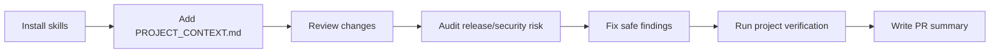

# AICodeReview

AI-agnostic code review skills you can drop into any project.

Works with **Claude Code**, **OpenAI Codex**, **Cursor**, **GitHub Copilot**, **Gemini CLI**, and **Aider** — one skill pack, every popular AI agent.

## Skills

| Skill | What it does |
|---|---|
| `code-review` | Review changes for bugs, regressions, security, performance, and missing tests |
| `security-audit` | Threat-model driven audit: injection, auth, secrets, data exposure, config, deps |
| `codebase-explainer` | Explain architecture and data flow for onboarding or returning to a repo |
| `review-fixer` | Apply concrete, low-risk fixes from review findings |
| `android-review` | Android/Kotlin/KMP/Compose-focused review |
| `ios-review` | iOS/macOS Swift/SwiftUI/Xcode-focused review |
| `web-review` | React/Next.js/TypeScript/Node-focused review |
| `release-review` | Release readiness check: blockers, privacy, build config, rollout risk |
| `pr-summary` | Write concise PR descriptions from local changes |
| `context-writer` | Create or refresh `PROJECT_CONTEXT.md` from real repo inspection |
| `changelog-writer` | Generate CHANGELOG entries from git commits |
| `dependency-audit` | Check for outdated, vulnerable, or risky dependencies |
| `agent-config-review` | Review AI agent config files for secrets, placeholders, and inconsistencies |
| `backend-review` | REST/GraphQL API, DB queries, auth, error handling, and service-layer review |
| `performance-review` | Profiling-guided review: latency, memory, N+1, caching, and rendering bottlenecks |
| `accessibility-audit` | WCAG 2.1 AA audit: semantics, keyboard nav, ARIA, color contrast, mobile a11y |
| `database-review` | Schema design, index strategy, migration safety, query efficiency, and data integrity |
| `test-writer` | Write unit, integration, and snapshot tests grounded in existing test style |
| `kmp-review` | Kotlin Multiplatform review: expect/actual, shared logic, platform-specific code |
| `docker-review` | Dockerfile and Compose review: layers, secrets, base images, multi-stage, health checks |
| `ci-review` | CI/CD pipeline review: pipeline hygiene, secrets, caching, test gating, and failure modes |
| `api-design-review` | API contract review: naming, versioning, auth, error shapes, idempotency, pagination |
| `flutter-review` | Flutter/Dart review: widget lifecycle, build perf, platform channels, state, release |
| `refactor-planner` | Plan safe, incremental refactors with blast radius, rollback steps, and feature flags |
| `architecture-review` | Dependency direction, circular deps, god modules, coupling, cohesion, layer violations |
| `code-smell-detector` | God classes, long methods, feature envy, dead code, duplicate blocks, magic numbers |
| `error-handling-review` | Silent catches, missing UI error states, retry without backoff, untyped errors |
| `graphql-review` | Schema design, resolver N+1, field-level auth, depth limits, breaking changes |
| `react-native-review` | JS thread, bridge usage, FlatList, memory leaks, CodePush safety, deep link security |
| `tech-debt-audit` | TODO/FIXME scan, deprecated APIs, untested critical paths, dead feature flags |
| `onboarding-writer` | Generate ONBOARDING.md from real repo inspection — setup, architecture, pitfalls, glossary |

## Supported Agents

| Agent | Format | Install target |
|---|---|---|
| Claude Code | `SKILL.md` | `~/.claude/skills/` |
| OpenAI Codex | `SKILL.md` + `openai.yaml` | `~/.codex/skills/` |
| Cursor | `.mdc` rules | `<project>/.cursor/rules/` |
| GitHub Copilot | Markdown instructions | `<project>/.github/copilot-instructions.md` |
| Gemini CLI | Markdown instructions | `<project>/GEMINI.md` |
| Aider | Conventions file | `<project>/CONVENTIONS.md` |

## Install

Clone the repo:

```bash
git clone https://github.com/SUDARSHANCHAUDHARI/AICodeReview.git
cd AICodeReview
```

**Claude Code + Codex (global, default):**

```bash
./install.sh
```

**Single agent:**

```bash
./install.sh --agent claude
./install.sh --agent codex
```

**Project-local agents (Cursor, Copilot, Gemini, Aider):**

```bash
./install.sh --agent cursor  --project /path/to/your/project
./install.sh --agent copilot --project /path/to/your/project
./install.sh --agent gemini  --project /path/to/your/project
./install.sh --agent aider   --project /path/to/your/project
```

**All agents at once (requires --project):**

```bash
./install.sh --agent all --project /path/to/your/project
```

**Other options:**

```bash
./install.sh --dry-run
./install.sh --agent global --dry-run
./install.sh --agent claude --force
./uninstall.sh --agent claude
./uninstall.sh --agent all --project /path/to/your/project
```

## Use

After installing, ask your AI agent to use a skill:

```text
Use code-review to review my current changes.
Use security-audit on this PR.
Use codebase-explainer to explain this repository.
Use review-fixer to fix only safe and concrete findings.
Use android-review to review my Compose and ViewModel changes.
Use ios-review to review my Swift and SwiftUI changes.
Use web-review to review my React and Next.js changes.
Use release-review to check whether this build is ready to ship.
Use pr-summary to write a PR description for my current changes.
Use context-writer to create PROJECT_CONTEXT.md for this repo.
Use changelog-writer to generate CHANGELOG entries from recent commits.
Use dependency-audit to check for outdated or vulnerable dependencies.
Use agent-config-review to review my AI agent configuration files.
Use backend-review to review my API and service layer.
Use performance-review to find latency and memory issues.
Use accessibility-audit to check WCAG compliance.
Use database-review to review my schema and migrations.
Use test-writer to write tests for this code.
Use kmp-review to review my Kotlin Multiplatform code.
Use docker-review to review my Dockerfile and Compose setup.
Use ci-review to review my CI/CD pipeline.
Use api-design-review to review my API contract.
Use flutter-review to review my Flutter/Dart code.
Use refactor-planner to plan a safe refactor of this module.
Use architecture-review to review module dependencies and layer violations.
Use code-smell-detector to find god classes and dead code.
Use error-handling-review to check all error paths.
Use graphql-review to review my GraphQL schema and resolvers.
Use react-native-review to review my React Native code.
Use tech-debt-audit to find and prioritize technical debt.
Use onboarding-writer to generate an ONBOARDING.md for this repo.
```

For Cursor, Copilot, Gemini, and Aider the instructions are written into project files — the agent reads them automatically based on your prompt.

## Workflow



## Per-Project Context

Copy the template into a repo you want reviewed:

```bash
cp templates/PROJECT_CONTEXT.md /path/to/project/PROJECT_CONTEXT.md
```

Fill it with the project stack, architecture, conventions, testing commands, and known migrations. All skills read this file when present so reviews stay grounded in your actual repo.

Examples:

- `examples/android-project-context.md`
- `examples/web-project-context.md`

## Design Philosophy

- Review real risks, not taste.
- Read actual files before making claims.
- Prefer small, working fixes over broad refactors.
- Keep findings line-referenced and severity-ranked.
- Use project context so reviews match the repo, not a generic checklist.
- One skill pack works across all popular AI agents — no duplication.

## Safety Notes

- Review and audit skills are read-only unless you explicitly ask for changes.
- The fixer skill is intentionally conservative and skips ambiguous findings.
- Keep secrets, signing files, `.env` values, private keys, and customer data out of context files.

## Tooling

```bash
./update.sh                              # pull latest + reinstall all detected agents
./list-installed.sh                      # show installed skills per agent
./list-installed.sh --project /path      # include cursor/copilot/gemini/aider
./check-health.sh                        # detect stale installs and broken section markers
./check-health.sh --project /path
```

## Tests

```bash
./tests/run-all.sh
```

## Validate

```bash
./scripts/validate.sh
```

## Contributing

See `SKILL_GUIDE.md` for how to write and submit a new skill.

## License

MIT
