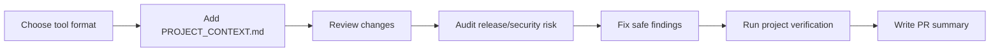

# AI Review Kit

Portable AI code review workflows you can drop into any repository.

This project is inspired by prompt-pack projects and built for practical solo-developer workflows: Android, Kotlin Multiplatform, web apps, CLIs, scripts, and small product repos.

The goal is simple: give AI coding tools enough structure to review real code changes consistently, without turning every review into a generic checklist.

## What You Get

- `codex-code-review`: production-focused review for bugs, regressions, security, performance, and missing tests.
- `codex-security-audit`: threat-model driven audit for injection, auth, secrets, data exposure, config, and dependency risk.
- `codex-codebase-explainer`: architecture and data-flow explanation for onboarding or returning to an old repo.
- `codex-review-fixer`: conservative fixer for concrete review findings.
- `codex-android-review`: Android/Kotlin/KMP/Compose-focused review.
- `codex-release-review`: release-readiness review for blockers, privacy, build config, and rollout risk.
- `codex-pr-summary`: concise PR descriptions from local changes.
- `codex-context-writer`: creates or refreshes `PROJECT_CONTEXT.md` from real repo inspection.
- `PROJECT_CONTEXT.md` template: a per-project memory file that keeps AI reviews grounded in your actual conventions.

## Tool Support

| Tool | Files |
| --- | --- |
| Codex | `skills/*/SKILL.md` |
| OpenCode | `.opencode/commands/*.md` |
| Claude Code | `.claude/commands/*.md` |
| Cursor | `.cursor/rules/ai-review-kit.mdc` |
| Windsurf | `.windsurf/rules/ai-review-kit.md` |
| Any AI tool | `prompts/*.md` |

## Install For Codex

Clone the repo:

```bash
git clone https://github.com/SUDARSHANCHAUDHARI/CodexReviewKit.git
cd CodexReviewKit
```

Install the Codex skills:

```bash
./install.sh
```

This copies the Codex skills into:

```text
~/.codex/skills/
```

Restart Codex if the new skills do not appear immediately.

Installer options:

```bash
./install.sh --dry-run
./install.sh --force
./uninstall.sh --dry-run
```

## Use With Codex

After installing, ask Codex to use one of the skills:

```text
Use codex-code-review to review my current changes.
```

```text
Use codex-security-audit on this PR.
```

```text
Use codex-codebase-explainer to explain this repository.
```

```text
Use codex-review-fixer to fix only the review findings that are safe and obvious.
```

```text
Use codex-android-review to review my Compose and ViewModel changes.
```

```text
Use codex-release-review to check whether this build is ready to ship.
```

```text
Use codex-pr-summary to write a PR description for my current changes.
```

```text
Use codex-context-writer to create PROJECT_CONTEXT.md for this repo.
```

## Use With OpenCode

Copy or keep `.opencode/commands/` in a project, then run commands like:

```text
/review
/review-security
/review-android
/review-release
/pr-summary
/write-context
```

## Use With Claude Code

Copy or keep `.claude/commands/` in a project, then run commands like:

```text
/review
/review-security
/review-android
/review-release
/pr-summary
/write-context
```

## Use With Cursor Or Windsurf

Copy the rules into your project:

```text
.cursor/rules/ai-review-kit.mdc
.windsurf/rules/ai-review-kit.md
```

Then ask the tool to use the AI Review Kit rules for reviews, security audits, PR summaries, or context writing.

## Use With Any AI Tool

Copy a prompt from `prompts/` into your tool:

```text
prompts/code-review.md
prompts/security-audit.md
prompts/android-review.md
prompts/release-review.md
prompts/pr-summary.md
prompts/context-writer.md
```

## Workflow



## What Is A Codex Skill?

A Codex skill is a small folder with a `SKILL.md` file. It tells Codex when to use a workflow and how to perform it.

This repo ships Codex skills alongside generic prompts and command formats for other tools, so you can inspect, edit, fork, and tune the workflows for your own projects.

## Example Prompts

```text
Use codex-code-review to review my current changes.
```

```text
Use codex-code-review and focus on Android lifecycle, Compose state, and missing tests.
```

```text
Use codex-security-audit before I publish this release build.
```

```text
Use codex-codebase-explainer to help me fill PROJECT_CONTEXT.md for this repo.
```

## Per-Project Context

Copy the template into a repo you want reviewed:

```bash
cp templates/PROJECT_CONTEXT.md /path/to/project/PROJECT_CONTEXT.md
```

Fill it with the project stack, architecture, conventions, testing commands, and known migrations. Commit it if it is safe to share with collaborators.

Do not put secrets, private keys, signing material, `.env` values, or private customer data in context files.

Examples:

- `examples/android-project-context.md`
- `examples/web-project-context.md`

## Design Philosophy

- Review real risks, not taste.
- Read the actual files before making claims.
- Prefer small, working fixes over broad refactors.
- Keep findings line-referenced and severity-ranked.
- Use project context so reviews match the repo, not a generic checklist.

## Safety Notes

- Review and audit skills are read-only unless you explicitly ask Codex to make changes.
- The fixer skill is intentionally conservative and should skip ambiguous findings.
- Keep secrets, signing files, `.env` values, private keys, and customer data out of context files.
- Public pushes, repo creation, repo deletion, and visibility changes should always require explicit approval.

## Validate

```bash
./scripts/validate.sh
```

## License

MIT
